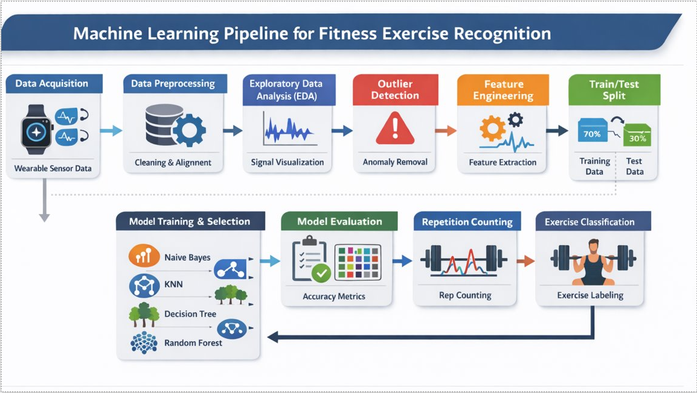
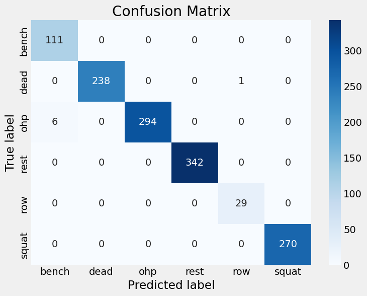

# 🏋️ Fitness Tracker using Machine Learning

A complete end-to-end machine learning project for classifying barbell exercises and counting repetitions using wearable sensor data (accelerometer + gyroscope).

---

## 📌 Project Overview

This project builds a full ML pipeline that transforms raw sensor data into meaningful fitness insights:

- 🏷️ Exercise Classification (Bench Press, Squat, Row, etc.)
- 🔁 Repetition Counting using signal processing
- 📊 Performance analysis across multiple users

---

## ⚙️ Machine Learning Pipeline

1. Data Collection (Wearable Sensors)
2. Data Cleaning & Preprocessing
3. Exploratory Data Analysis (EDA)
4. Outlier Detection
5. Feature Engineering
6. Model Training & Evaluation
7. Repetition Counting Algorithm

---

## 🤖 Models Implemented

- Naive Bayes
- K-Nearest Neighbors (KNN)
- Decision Tree
- Random Forest ⭐ (Best Performance)
- Neural Network

---

## 📊 Results

- ✅ ~99% Accuracy using Random Forest
- ✅ Strong generalization across users
- ✅ Reliable repetition counting

---

## 📂 Project Structure
```text
data/              # Raw, interim, and processed datasets
docs/              # Project documentation
models/            # Trained models and predictions
notebooks/         # Analysis and experimentation notebooks
references/        # Data dictionaries and manuals
reports/           # Generated analysis and reports
├── final_report/
│   ├── main.tex
│   ├── figures/
│   ├── references.bib
│   └── final_report.pdf
└── presentation/
    ├── presentation.pdf
    └── presentation.pptx
src/               # Core ML pipeline (data, features, models, visualization)
environment.yml    # Conda environment configuration
README.md          # Project overview
requirements.txt   # Python package dependencies
```

---

## 🧠 Project Pipeline



---

## 📊 Sample Results



---

## 📎 Documentation

- 📄 Final Report: `reports/ML_Fitness_Tracker_Project.pdf`
- 🎤 Presentation: `reports/ML_Fitness_Tracker_Project.pptx`

---

## 🚀 How to Run

```bash
pip install -r requirements.txt
```
Run notebooks or scripts from the `src/` directory.

---

## 👨‍💻 Contributors

- **Mohammed Eid** — [GitHub Profile](https://github.com/M0hamed-Eid)
- **Ahmed Hossam** — [GitHub Profile](https://github.com/AhmedxHossam)
- **Mohammed Salah** — [GitHub Profile](https://github.com/msalah65654-hue)

---


## 🔗 Repository
👉 [https://github.com/M0hamed-Eid/FitnessTracker](https://github.com/M0hamed-Eid/FitnessTracker)
